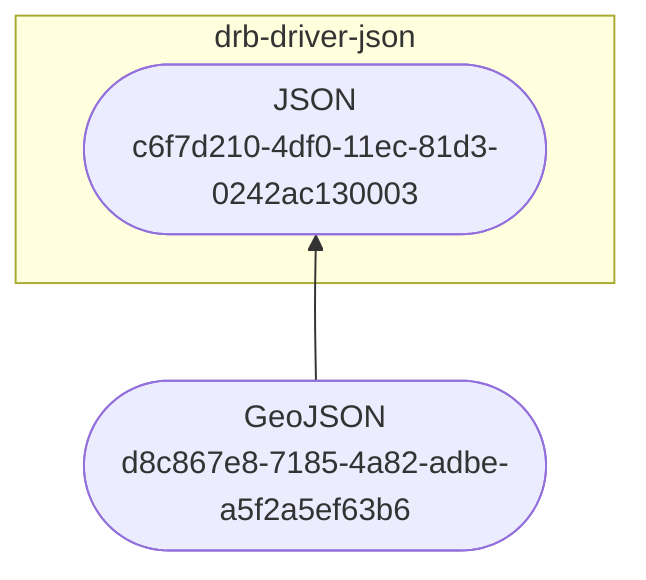

# GeoJSON DRB topic

The `drb-topic-geojson` is a DRB plugin declaring a topic about
[GeoJSON](https://geojson.org/) data.

## Installation
```shell
pip install drb-topic-geojson
```

## GeoJSON topic
This section references the topic defined in this DRB plugin.

